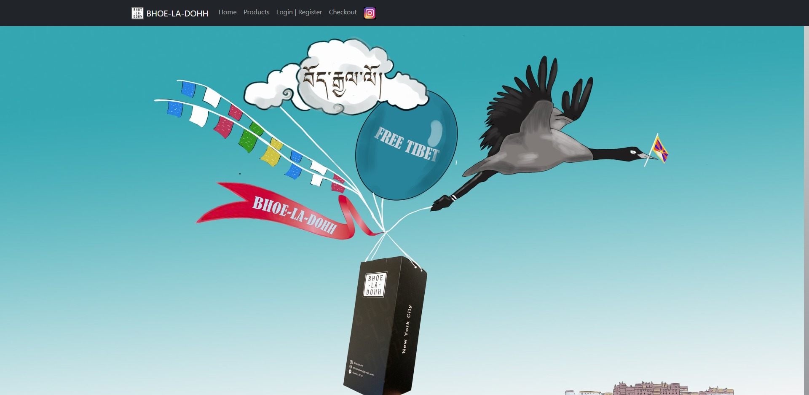
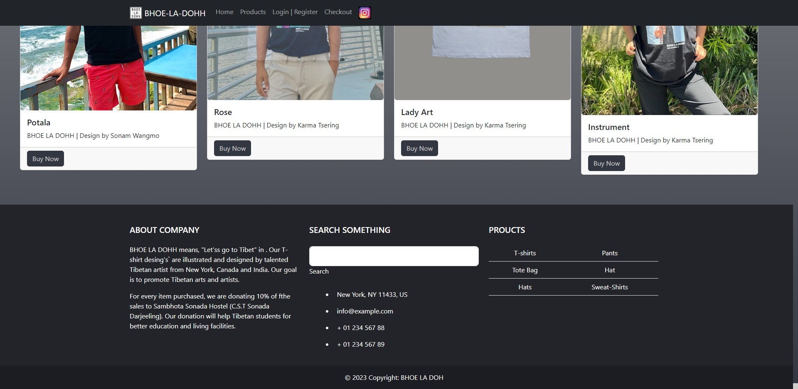
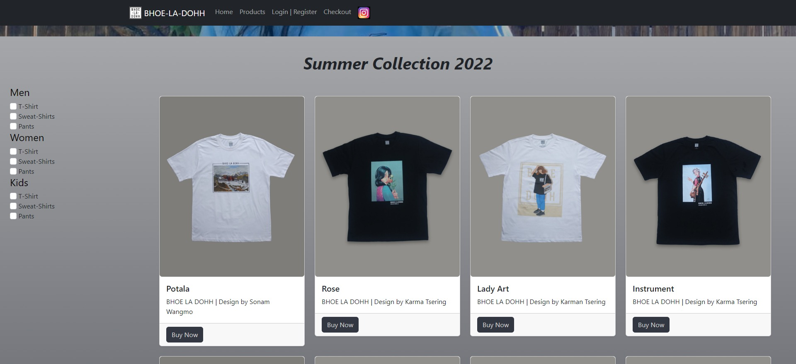
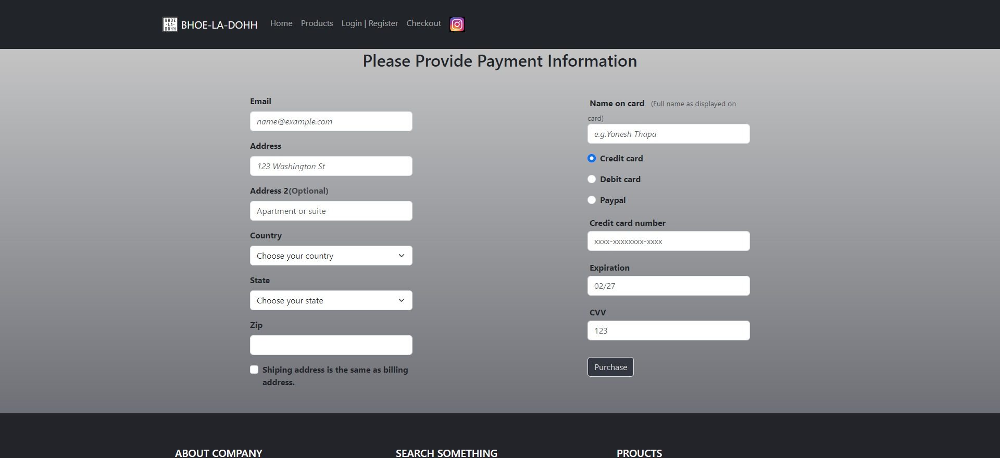

# Capstone-1-ver-

**BHOE LA DOHH
Established in summer 2021. 
BHOE LA DOHH means, “Let’s go to Tibet” in Tibetan Language. Our T-shirt design’s are illustrated and designed by talented Tibetan artist from New York, Canada and India. Our goal is to promote Tibetan arts and artists.

For every item purchase, we are donating 10% of the sales to Sambhota Sonada Hostel (C.S.T Sonada, Darjeeling). Our donation will help Tibetan students for better education and living facilities.

Bhoe-La-Dohh

## Site images

##Interesting piece of html
## navigation bar
<header>
        <nav class="navbar navbar-expand-lg navbar-dark fixed-top bg-dark bg-primary">
            

                <a class="navbar-brand" href="index.html">
                    
                    BHOE-LA-DOHH
                </a>

                <button class="navbar-toggler" type="button" data-bs-toggle="collapse" data-bs-target="#navbarCollapse"
                    aria-controls="navbarCollapse" aria-expanded="false" aria-label="Toggle navigation">
                    
                </button>

                

                    <ul class="nav navbar-nav mr-auto">
                        <li class="nav-item active">
                            <a class="nav-link" aria-current="page" href="index.html">Home</a>
                        </li>
                        <li class="nav-item">
                            <a class="nav-link" href="products.html">Products</a>
                        </li>
                        <li class="nav-item">
                            <a class="nav-link" href="login.html">Login | Register</a>
                        </li>
                        <li class="nav-item">
                            <a class="nav-link text" href="checkout.html">Checkout</a>
                        </li>
                        <li class="nav-item">
                            
                        </li>

                    </ul>
                

            

        </nav>
    </header>

##Another piece of code that uses HTML CSS and BOOSTRAP 
## Addding a carousel inside a card.

      

                

                    

                        

                            

                                

                                    
                                

                                

                                    
                                

                                

                                    
                                

                            

                        

                        

                            <h5 class="card-title">Potala</h5>
                            
BHOE LA DOHH | Design by Sonam Wangmo

                        

                        

                            <a href="potala.html" class="btn">
                                Buy Now
                            </a>
                        

                    

                
